# Pi Vision Project Documentation

## Chapter I. Practical Utility

Pi Vision is a modular, smart webcam platform designed to keep the subject perfectly centered without reducing image quality. It processes images locally, so it does not affect your computer’s performance. This makes it ideal for streaming and videoconferencing.

The webcam works autonomously in any environment—as long as there is a subject to follow. It’s suitable for any workspace requiring a video connection and can be used for:

- **Videoconferences:** Keeps you centered without manual adjustments for a smooth, professional meeting.
- **Streaming:** Perfect for live streaming (games, events, etc.) by automatically focusing on the subject.
- **Video Recording:** Records high-quality videos like vlogs or tutorials, always keeping the subject in frame.
- **Mobile Robotics:** Can be integrated into mobile robots for autonomous navigation and enhanced interaction.

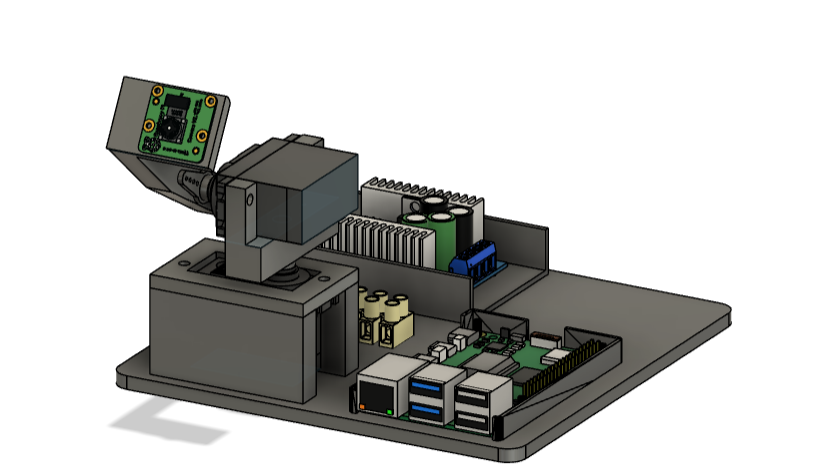

---

## Chapter II. Mechanics

### 1. Mechanical Design

- **Degrees of Freedom:**  
  The device uses two servo motors to allow two independent axes, giving a wide field of view. The design uses direct drive—meaning no extra gears or belts are required.

- **Modular Construction:**  
  The design is simple and modular, allowing easy attachment of different accessories (like sensor or mobile robot kits).

### 2. Construction Efficiency

- **3D Printing:**  
  Designed with Autodesk Fusion and sliced with Bambu Studio, the parts are optimized for 3D printing without supports and minimal material waste.  
  Printing time is kept under 8 hours, and the design is easily modifiable for different hardware.

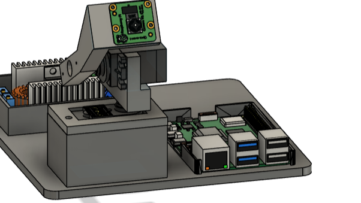  
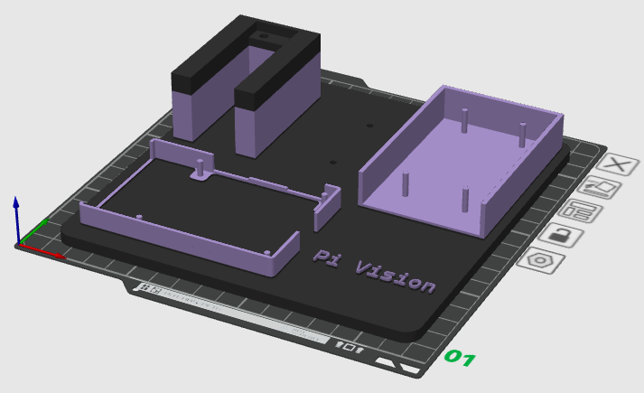

---

## Chapter III. Electronics

### 1. Microprocessor

**Raspberry Pi 5 (8GB):**  
  Handles image processing and sends directional commands. It also manages sensor data when additional modules are connected.  
  It’s compact, energy efficient, and supports a high-quality camera.

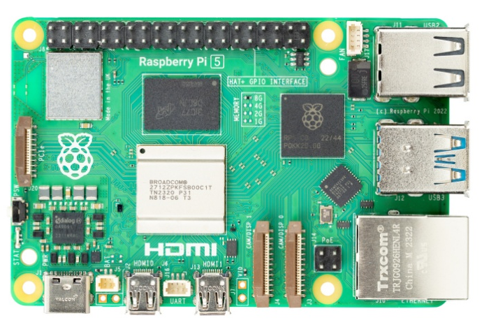

### 2. Microcontroller

**Raspberry Pico:**  
  Offloads tasks from the Raspberry Pi and controls the servo motors using hardware PWM (which the Pi’s GPIO cannot do directly). The Pico is connected via UART for precise control.

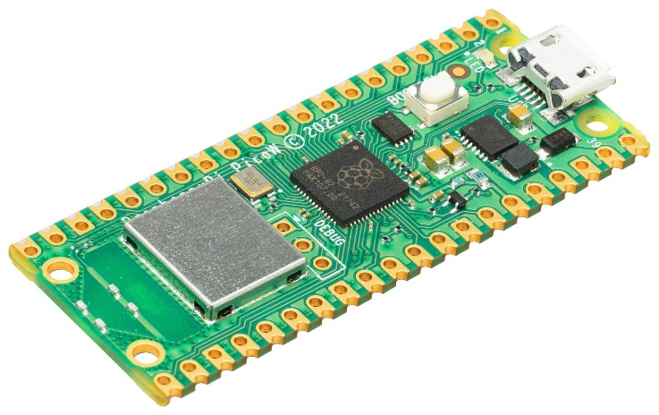

### 3. Circuit Design

**Modular PCB:**  
  The microcontroller is mounted on a PCB with screw connectors, making it easy to expand and maintain without soldering.

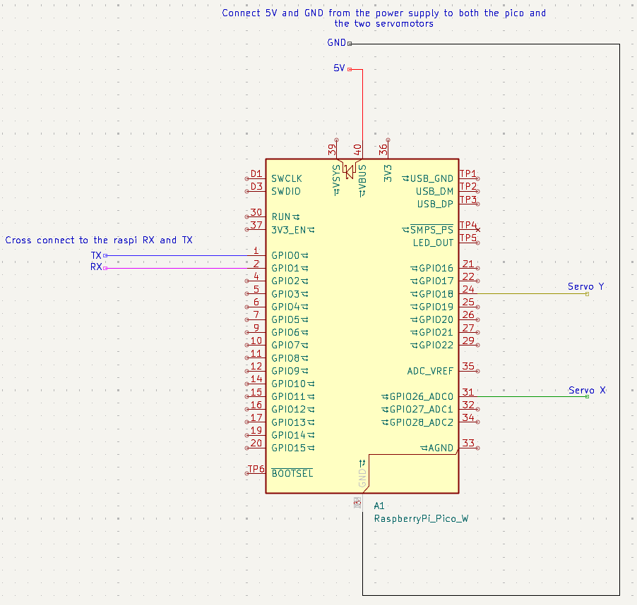  

### 4. Power Supply

**Two-Part System:**  
  - **Rectifier:** Converts AC to 20V DC for the primary power.
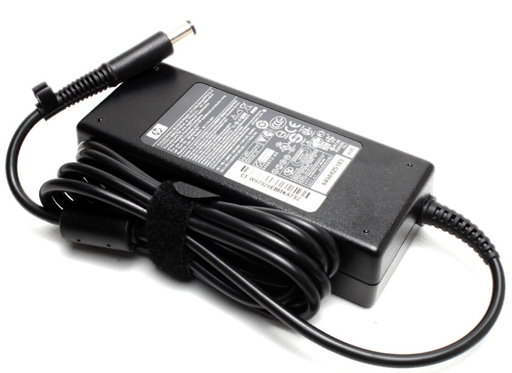
  - **Voltage Regulator:** Steps down 20V to 5V for both the servo motors and electronics, with built-in safety features against short circuits.  
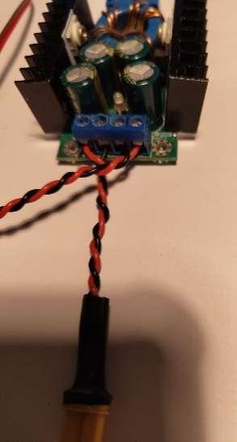

### 5. Accessibility

**Easy Maintenance:**  
  Components are openly mounted and accessible, allowing quick troubleshooting with standard tools like a multimeter.

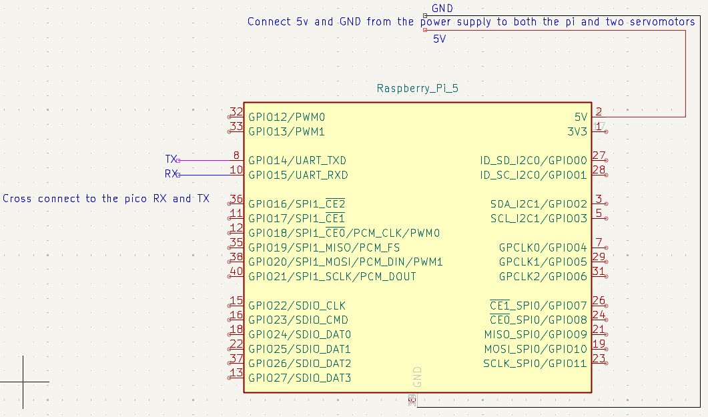  

### 6. Energy Efficiency

**Battery Operation:**  
  When powered by a 2s 75C 700mAh LIPO battery, the system can run for nearly 2 hours.

---

## Chapter IV. Software

### Dual Device Setup

**Raspberry Pi:**  
  Captures and processes images using OpenCV (cv2 with picamera2) and a pre-trained AI model (using TensorFlow Lite with MediaPipe Face Landmark Detection). It sends simple commands (up/down, left/right) via UART based on the subject’s position.

**Raspberry Pico:**  
  Receives the UART signals and controls the servo motors by converting PWM signals to specific angles. This helps in keeping the cables tension-free and the movements smooth.

### Operating Modes

**Tracking Modes:**  
  Various AI modules (face detection, object recognition, gesture detection, etc.) can be run on the Raspberry Pi.
**Monitoring Modes:**  
  The system can work without active tracking—using keyboard controls, a mobile app, or auto-scanning—plus display sensor data if a sensor kit is attached.

---

## Chapter V. Industrial Design

### 1. Design and Assembly

**3D Printed Parts:**  
  The design in Autodesk Fusion is optimized for 3D printing without supports, ensuring minimal material waste and strong parts.  
  It is designed for fast printing (under 8 hours) and can be printed on compact machines like the Prusa Mini or Bambulab A1 Mini.

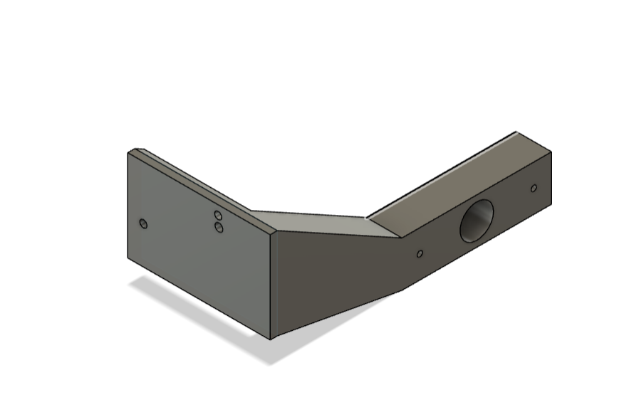 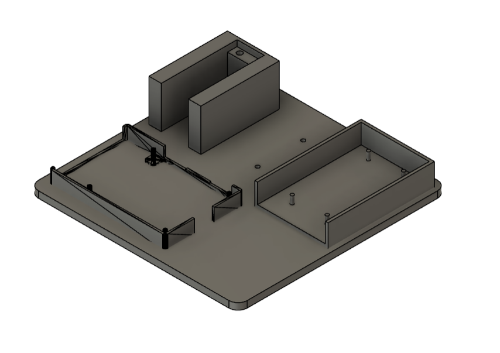  
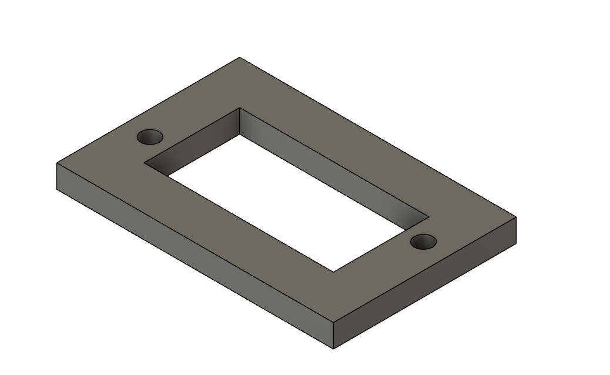 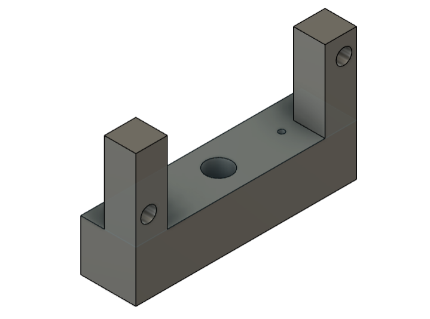  
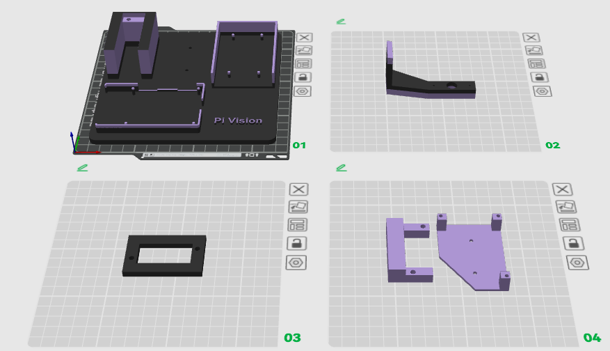

### 2. Quick Assembly

**Assembly Time:**  
  - 3D printing: ~ 7-8 hours  
  - Mechanical assembly: ~30 minutes  
  - Electronics assembly: 15–60 minutes (depending on PCB pre-assembly)  
  - Programming: ~10 minutes

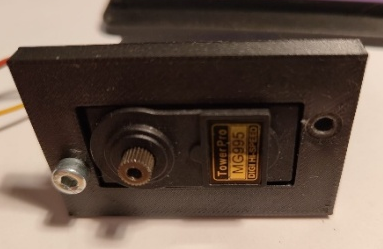  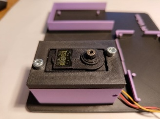  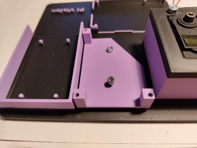  
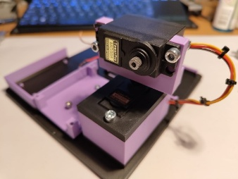  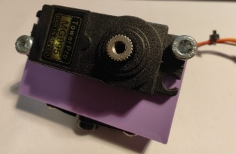  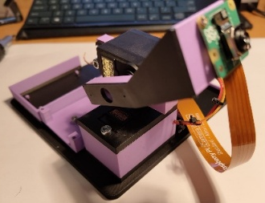  
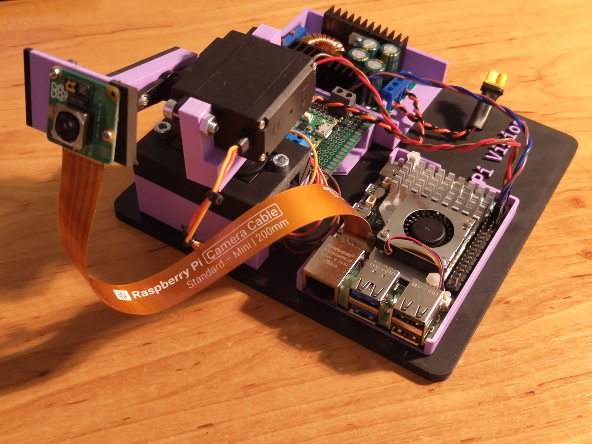  

### 3. Build Efficiency

**Material Use:**  
    Uses about 200 grams of filament. The modular design fits well with other products in its class. It can be easily adapted for various technical skills and budgets (for example, using a Raspberry Pi 4 might eliminate the need for a Pico).

### 4. Future Developments / Coming Soon

- Android app for remote control and monitoring.
- Server mode for external network access.
- Adding a degree of freedom for depth control (zooming).
- A graphical interface for operating modes.
- Implementation as an external USB webcam.
